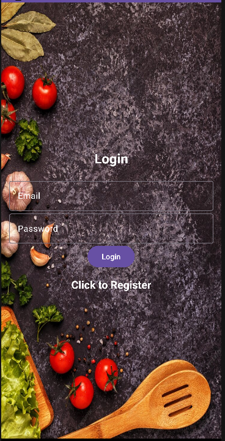
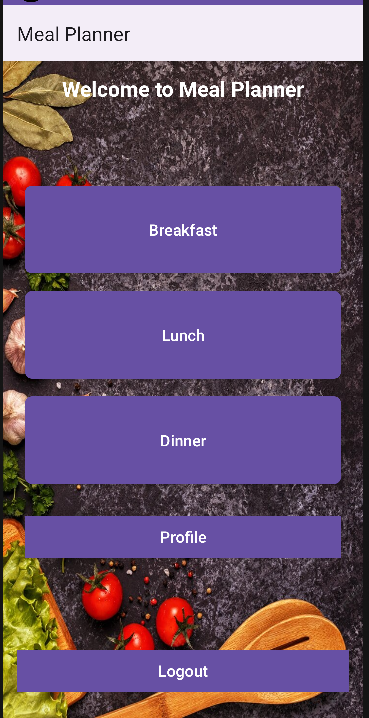
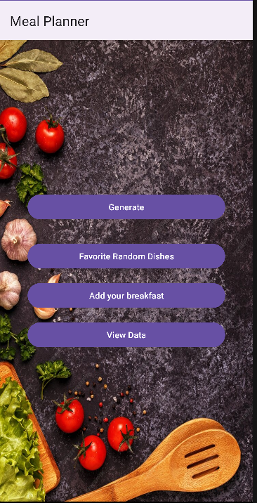
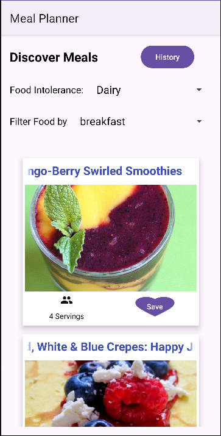
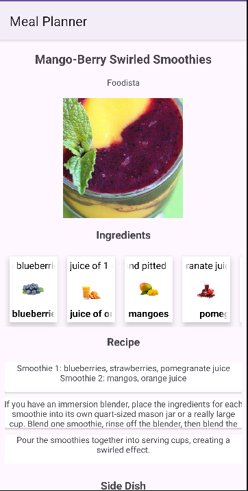
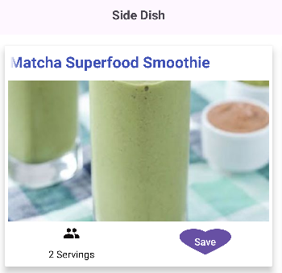
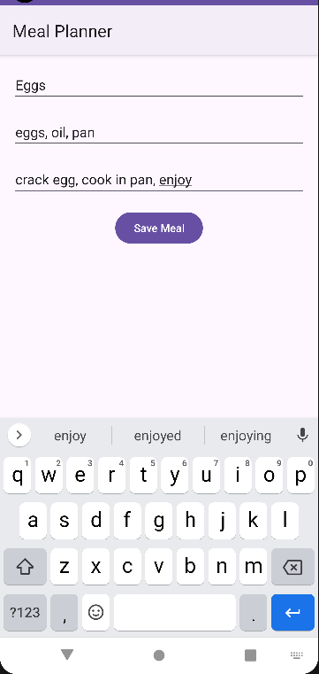
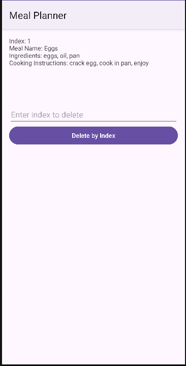
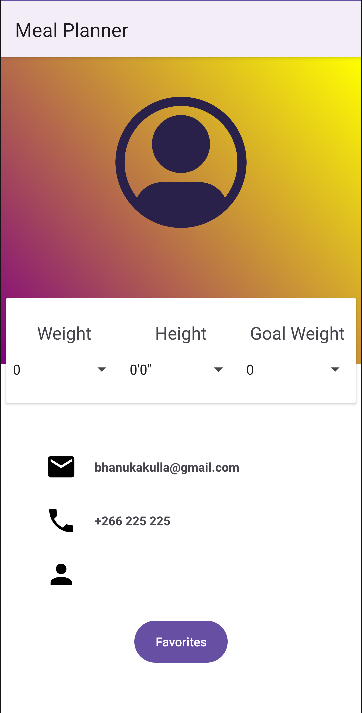

# MealPlanner

Meal Planner App

Project Team:
Bhanu Kakulla, 
Joseph Lohman, 
Oluwasogo Enoch Awofeso, 
Sandeep Vepuri

College of Engineering and Applied Sciences
University at Albany, SUNY

Project Sponsor:
Dr. Pradeep Atrey
University at Albany
University at Albany - State University of New York
May 5, 2024

How to run code:

1) Download zip folder through git
2) Open folder in Android Studio
3) Run build
4) Run app to emulate on phone emulator

Login/Register Page

Home Page

Options Page

Generate meals Page

Meal Details Page

Side dish Page

Enter own meal Page

View own meal Page

Profile Page

